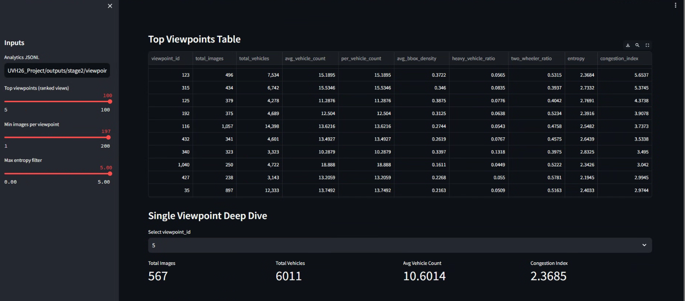
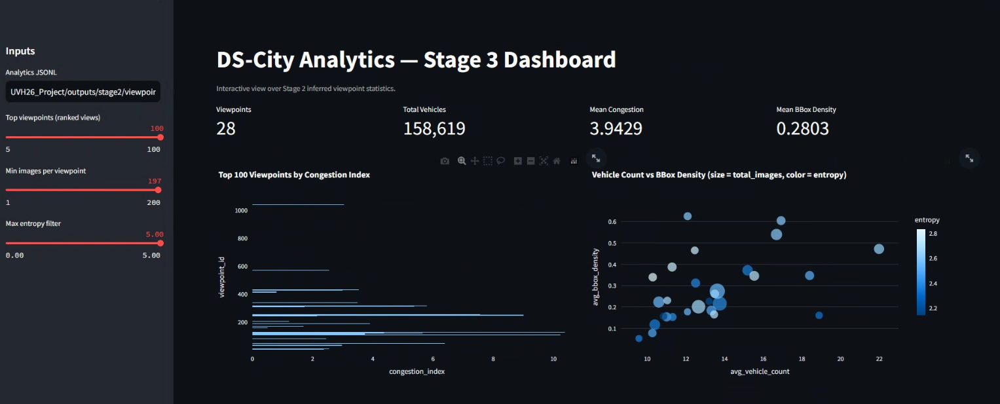

# Distributed Viewpoint-Level Traffic Analytics over UVH-26 Using Apache Spark: Design, Execution Pipeline, and Interactive Insight Layer

**Group 8 — Case Study on Apache Spark with Application on City-Wide Analytics**

| Name | Roll Number |
|---|---|
| **Dhrusheek Rishi Menon** | CB.SC.U4CSE23716 |
| **Nethi Kushala Kumar** | CB.SC.U4CSE23735 |
| **Rishinath Kurup** | CB.SC.U4CSE23741 |
| **Yalamanchi Kushal** | CB.SC.U4CSE23766 |

**Date:** March 2026

**GitHub Repository: https://github.com/not-good-keeper/DS-City-Analytics**

---

**Abstract—**This report presents a complete end-to-end distributed analytics workflow for traffic-scene understanding over the UVH-26 dataset, implemented as a three-stage pipeline: (i) deterministic viewpoint reconstruction (Stage 1), (ii) Spark-based distributed aggregation and metric computation (Stage 2), and (iii) interactive visual analytics for decision support (Stage 3). The core technical challenge is transforming image-level and annotation-level data into viewpoint-level intelligence at scale while preserving reproducibility and operational clarity. To address this challenge, the system introduces a distribution-aware mapping transformation that converts one-to-one image-to-viewpoint records into one-to-many grouped viewpoint workloads and balanced bucket assignments suitable for parallel execution across workers. The Stage 2 engine is built on Apache Spark DataFrames and Spark SQL operators, combining normalization, broadcast joins, grouped reductions, class-probability estimation, and entropy/congestion scoring. The output artifact contains 4,780 viewpoint rows generated from 26,646 mapped images, each row encoding traffic composition, density, and uncertainty descriptors. Stage 3 operationalizes these outputs via a Streamlit + Plotly interface that supports ranking, filtering, and viewpoint-level deep dive analysis. The report emphasizes distributed-system concerns including partitioning, shuffle behavior, adaptive query execution, reproducibility controls, and evidence-oriented logging. Results indicate that the architecture is suitable for medium-scale camera-view aggregation tasks and can be extended to larger multi-city datasets with minimal changes in analytical logic.

**Index Terms—**Distributed systems, Apache Spark, traffic analytics, viewpoint reconstruction, data engineering, congestion modeling, entropy, interactive dashboards.

## I. INTRODUCTION

Urban traffic analytics is increasingly data-intensive: modern datasets contain large image corpora, dense annotations, and heterogeneous vehicle categories captured across many spatial viewpoints. While single-node scripts can compute statistics for limited subsets, they often become difficult to maintain, reproduce, and scale when the objective is full-coverage viewpoint intelligence. Distributed systems are therefore not only a performance choice but an engineering requirement for reliability, traceability, and extensibility.

This project treats the problem as a distributed dataflow challenge. Instead of asking only how many detections exist in the dataset, it asks how traffic composition, density, and congestion-like behavior vary per inferred camera viewpoint. This shift from image-level to viewpoint-level semantics is important for intelligent transportation use cases such as hotspot triage, corridor diagnostics, and camera-wise monitoring.

The implemented solution spans three coordinated stages. Stage 1 generates deterministic image-to-viewpoint mapping from UVH-26 imagery. Stage 2 executes distributed metric synthesis in Apache Spark. Stage 3 exposes the resulting features in an interactive dashboard suitable for analysts and operators. The center of gravity of this report is Stage 2, where distributed-system design decisions determine whether the full pipeline remains both performant and reproducible.

## II. PROBLEM STATEMENT AND OBJECTIVES

### A. Problem Statement

Given (1) a mapping between image identifiers and reconstructed viewpoint identifiers, and (2) COCO-style annotations (images, categories, bounding boxes), compute robust viewpoint-level traffic indicators in a distributed manner. The system must preserve metric consistency across smoke and full runs, support structured artifact generation, and provide explainable outputs for downstream visualization.

### B. Objectives

1) Build a reproducible distributed analytics engine over Spark Standalone.  
2) Convert Stage 1 outputs into distribution-friendly grouped workload structures.  
3) Compute interpretable viewpoint metrics: counts, densities, class composition, entropy, and congestion index.  
4) Preserve run evidence through explicit logs and deterministic artifacts.  
5) Provide an interactive exploration layer for rapid insight extraction.

## III. SYSTEM OVERVIEW

### A. Stage 1: Deterministic Viewpoint Reconstruction

Stage 1 produces a mapping file with schema `(image_id, viewpoint_id)`. This representation is semantically correct but operationally minimal. It is suitable for association but not ideal for workload partitioning or balanced scheduling.

### B. Stage 2: Distributed Analytics Engine

The Stage 2 engine (`spark_jobs/analytics_job.py`) is implemented using Spark DataFrame transformations and actions. It reads Stage 1 mappings and UVH-26 train/validation COCO JSON payloads, normalizes arrays into row-level structures, and computes per-image and per-viewpoint metrics through distributed `groupBy` and aggregation operations. Runtime controls include shuffle partitions, default parallelism, optional master override, and preview-oriented output mode for rapid validation.

### C. Stage 3: Interactive Insight Layer

Stage 3 (`stage3/dashboard_app.py`) reads JSONL viewpoint metrics and renders KPI cards, ranking charts, scatter analyses, histograms, and per-viewpoint class-distribution deep dives. It forms the analytical consumption layer and improves interpretability for non-pipeline stakeholders.

## IV. DISTRIBUTED ARCHITECTURE AND EXECUTION MODEL

### A. Cluster-Oriented Deployment Model

The analytics engine is designed for Spark Standalone deployment with submission through `spark-submit --master spark://<master-host>:7077`. In this model, the driver coordinates logical plans while executors process partitioned datasets across workers. The pipeline’s distributed behavior is dominated by three classes of operations: wide joins, grouped reductions, and shuffle-driven aggregation.

### B. Distribution-Aware Preprocessing

A dedicated transformer (`build_viewpoint_mapping.py`) converts one-to-one mappings into grouped viewpoint structures and bucket assignments. This produces:

- `viewpoint_to_images.jsonl` (one record per viewpoint, includes image list),
- `viewpoint_to_images.csv`,
- `viewpoint_bucket_assignment.csv`,
- `bucket_summary.csv`.

Bucket assignment applies a greedy balancing strategy: viewpoints sorted by descending image count are iteratively assigned to the currently lightest bucket. This approximates load balancing and reduces executor skew risk during viewpoint-centric tasks.

### C. Spark Runtime Controls

The pipeline configures:

- `spark.sql.shuffle.partitions` (default 48),
- `spark.default.parallelism` (default 48),
- `spark.sql.adaptive.enabled=true`.

These settings interact with workload cardinality and executor resources. Shuffle partition count influences task granularity during joins and aggregations, while adaptive query execution (AQE) improves plan quality under runtime statistics.

### D. Join and Aggregation Strategy

The mapping table is broadcast during annotation-image-viewpoint joining when small enough, reducing network-heavy shuffle joins. This matches Spark SQL guidance on broadcast optimization and is especially beneficial when the mapping dimension is compact relative to annotation rows.

## V. DATAFLOW AND METRIC FORMULATION

### A. Input Contracts

Inputs include:

1) Stage 1 mapping CSV (`image_id, viewpoint_id`),  
2) COCO JSON (`images`, `annotations`, `categories`) for train and validation partitions.

The normalization layer explodes nested arrays and derives stable keys. `image_id` is normalized from filename stems to ensure consistent mapping joins across datasets.

### B. Per-Image Intermediate Metrics

For each `(viewpoint_id, image_id)` pair, the system computes:

- `vehicle_count`: annotation count,
- `total_bbox_area`: sum of instance area,
- `image_area`: width × height,
- `bbox_density = total_bbox_area / image_area`,
- heavy and two-wheeler class counts via keyword-group rules.

### C. Per-Viewpoint Final Metrics

Viewpoint-level aggregation yields:

- `total_images`, `total_vehicles`,
- `avg_vehicle_count`, `per_vehicle_count`,
- `avg_bbox_density`,
- `heavy_vehicle_ratio`, `two_wheeler_ratio`,
- `entropy`,
- `congestion_index`,
- `class_distribution_vector`.

The primary equations are:

$$
\text{per\_vehicle\_count} = \frac{\text{total\_vehicles}}{\text{total\_images}}
$$

$$
\text{avg\_bbox\_density} = \frac{1}{N_v}\sum_{i=1}^{N_v} \frac{\text{bbox\_area}_i}{\text{image\_area}_i}
$$

$$
H(v) = -\sum_{c \in C} p(c|v)\log_2 p(c|v)
$$

$$
\text{congestion\_index}(v) = \text{avg\_vehicle\_count}(v) \times \text{avg\_bbox\_density}(v)
$$

where $v$ is viewpoint, $N_v$ is number of images in viewpoint $v$, and $C$ is the vehicle-class set.

### D. Code Excerpt (Distributed Runtime Bootstrap)

```python
builder = SparkSession.builder.appName(args.app_name)
if args.master:
    builder = builder.master(args.master)
builder = builder.config("spark.sql.shuffle.partitions", str(args.shuffle_partitions))
builder = builder.config("spark.default.parallelism", str(args.default_parallelism))
builder = builder.config("spark.sql.adaptive.enabled", "true")
spark = builder.getOrCreate()
```

This snippet illustrates the explicit coupling between logical pipeline behavior and distributed execution controls.

## VI. EXPERIMENTAL PROCESS AND REPRODUCIBILITY

### A. Smoke-to-Full Validation Ladder

The project follows a two-step execution strategy:

1) **Smoke run** using first 10 viewpoints and 100 images (`create_smoke_mapping.py`),  
2) **Full run** over complete mapping coverage.

This ladder mitigates expensive failure loops and validates schema, joins, and metrics early before full-volume execution.

### B. Full Artifact Statistics

The committed Stage 2 artifact `viewpoint_analytics_full_4780vp.jsonl` contains:

- Input mapping rows: **26,646**,
- Output viewpoint rows: **4,780**,
- Joined annotation rows (pipeline statistic): **316,220**.

These numbers demonstrate non-trivial aggregation coverage and confirm that the pipeline scales beyond toy subsets.

### C. Logging for Auditability

The run logger records Spark context metadata and dataflow counters:

- Spark application ID,
- Spark master URI,
- default parallelism,
- shuffle partitions,
- AQE status,
- mapping/join/output row counts,
- partition counts and wall-clock timing.

This logging schema is important in distributed systems because correctness includes both output validity and execution provenance.

## VII. RESULTS AND ANALYSIS

### A. Output Quality and Interpretability

The output schema is intentionally compact but expressive: one row per viewpoint with both intensity and composition descriptors. This design supports ranking (e.g., by congestion index), filtering (e.g., by entropy), and causal hypothesis generation (e.g., whether high congestion correlates with heavy-vehicle dominance).

### B. Congestion and Composition Signals

Unlike raw count-only summaries, combined metrics (vehicle count × spatial occupancy) capture both object frequency and image occupancy pressure. Entropy further adds distributional uncertainty information: viewpoints with low entropy and high congestion may represent persistent, compositionally stable bottlenecks; high-entropy viewpoints may indicate mixed and dynamic traffic states.

### C. Scalability Observations

The use of DataFrame operations and distributed `groupBy` over normalized annotations keeps the implementation concise while leveraging Spark’s optimizer. Broadcast mapping join reduces unnecessary large-shuffle joins, and AQE improves runtime plan adaptation. The resulting implementation is readable enough for research teams yet sufficiently engineered for production-oriented extensions.

## VIII. STAGE 3 VISUAL ANALYTICS LAYER

Stage 3 transforms numerical artifacts into analytical workflows. The dashboard includes:

1) KPI cards (viewpoints, total vehicles, mean congestion, mean density),  
2) Top-congestion ranking chart,  
3) Density-vs-count scatter with entropy encoding,  
4) Heavy-ratio vs two-wheeler-ratio composition plot,  
5) Congestion histogram,  
6) viewpoint-level table and deep dive class-distribution chart.

This layer significantly reduces interpretation latency: users can move from global distributions to single-viewpoint diagnostics within one interface.

**Fig. 1** shows the Stage 3 overview with KPI and ranking context.



**Fig. 2** shows tabular ranking and single-viewpoint deep dive.



## IX. DISTRIBUTED SYSTEMS DISCUSSION

### A. Why This Is a Distributed-First Design

The project is distributed-first because key operations are architected around partitioned compute semantics, not serial loops. Data is represented as distributed tables, transformations are declarative and optimizer-aware, and runtime configuration explicitly exposes parallelism and shuffle behavior.

### B. Skew and Load-Balance Considerations

Viewpoint cardinalities are naturally imbalanced. Without pre-balancing, large viewpoints can generate straggler tasks. The bucket assignment preprocessor is therefore more than convenience; it is a practical anti-skew mechanism for downstream multi-node scheduling and workload slicing.

### C. Fault Tolerance and Operational Safety

Spark’s lineage-based recomputation model, stage retry behavior, and master/worker architecture provide resilience compared with brittle monolithic scripts. In addition, explicit logging and preview outputs make fault diagnosis and output verification far easier in collaborative environments.

### D. Engineering Trade-offs

The chosen approach favors maintainability and reproducibility over highly specialized hand-tuned optimizations. For medium-scale datasets this trade-off is favorable, as team members can reason about the pipeline and reproduce results quickly.

## X. LIMITATIONS AND FUTURE WORK

Current metric definitions are intentionally generic and derived from available annotation semantics. Future extensions can include lane-aware priors, temporal smoothing across contiguous frames, and graph-based viewpoint neighborhood aggregation. Additional opportunities include:

1) Storage partitioning and file-format optimization (e.g., partitioned Parquet + compaction),  
2) stronger skew-aware repartitioning strategies under evolving data distributions,  
3) model-assisted class grouping beyond keyword rules,  
4) online ingestion and incremental updates with Structured Streaming.

At the distributed-infrastructure level, production hardening can integrate high-availability Spark masters, stricter cluster security policy, and continuous monitoring dashboards.

## XI. CONCLUSION

This report has documented a complete distributed analytics stack for viewpoint-level traffic intelligence over UVH-26. The project demonstrates that reliable city-traffic insight pipelines require more than model inference: they require careful workload representation, distributed joins/aggregations, metric formalization, evidence-oriented runtime logging, and user-facing exploratory tooling. By combining deterministic viewpoint reconstruction, Spark-native distributed metric synthesis, and interactive visualization, the system provides a practical template for transport analytics teams operating on large, annotation-rich image corpora.

The final artifact set—grouped mappings, bucket assignments, full JSONL metrics, logs, and dashboard views—supports both engineering reproducibility and analytic interpretability. Most importantly, the architecture remains extensible: new metrics, larger datasets, and richer distributed deployments can be incorporated while retaining the same core dataflow principles.

## REFERENCES

[1] Apache Spark Project, "Apache Spark Documentation (Latest)," 2026. [Online]. Available: https://spark.apache.org/docs/latest/.  
[2] Apache Spark Project, "Spark Standalone Mode," 2026. [Online]. Available: https://spark.apache.org/docs/latest/spark-standalone.html.  
[3] Apache Spark Project, "Spark SQL, DataFrames and Datasets Guide," 2026. [Online]. Available: https://spark.apache.org/docs/latest/sql-programming-guide.html.  
[4] Apache Spark Project, "Spark SQL Performance Tuning," 2026. [Online]. Available: https://spark.apache.org/docs/latest/sql-performance-tuning.html.  
[5] M. Zaharia *et al.*, "Apache Spark: A Unified Engine for Big Data Processing," *Communications of the ACM*, vol. 59, no. 11, pp. 56-65, 2016. doi: 10.1145/2934664.  
[6] J. Dean and S. Ghemawat, "MapReduce: Simplified Data Processing on Large Clusters," in *Proc. 6th USENIX Symposium on Operating Systems Design and Implementation (OSDI)*, 2004. [Online]. Available: https://www.usenix.org/conference/osdi-04/mapreduce-simplified-data-processing-large-clusters.  
[7] T.-Y. Lin *et al.*, "Microsoft COCO: Common Objects in Context," 2014. doi: 10.48550/arXiv.1405.0312. [Online]. Available: https://arxiv.org/abs/1405.0312.  
[8] C. E. Shannon, "A Mathematical Theory of Communication," *Bell System Technical Journal*, vol. 27, no. 3, pp. 379-423, 1948. doi: 10.1002/j.1538-7305.1948.tb01338.x.  
[9] Streamlit, "Streamlit Documentation," 2026. [Online]. Available: https://docs.streamlit.io/.  
[10] Plotly Technologies Inc., "Plotly Open Source Graphing Library for Python," 2026. [Online]. Available: https://plotly.com/python/.  
[11] Apache Spark Project, "Submitting Applications," 2026. [Online]. Available: https://spark.apache.org/docs/latest/submitting-applications.html.  
[12] A. Sharma *et al.*, "Towards Image Annotations and Accurate Vision Models for Indian Traffic, Preliminary Dataset Release, UVH-26-v1.0," Indian Institute of Science, 2025. doi: 10.48550/arXiv.2511.02563.
